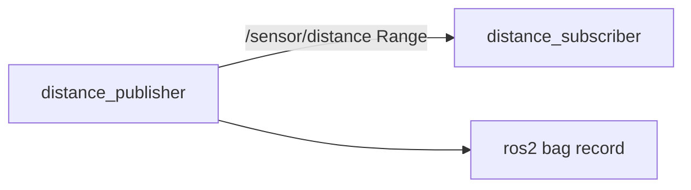

# Week 2: ROS2 Basics

Minimal ROS2 Humble demo: fake distance sensor publisher + subscriber, launch file, and rosbag workflow.

**Run inside Ubuntu 22.04 VM with ROS2 Humble** (see [notes/environment.md](../notes/environment.md)).

## Architecture



## Topics

| Topic | Type | Description |
|-------|------|-------------|
| `/sensor/distance` | `sensor_msgs/Range` | Simulated distance readings (0.1–5.0 m) |

## Build

```bash
cd week02_ros2_basics/ros2_ws
source /opt/ros/humble/setup.bash
colcon build --symlink-install
source install/setup.bash
```

## Run

### Option A: Launch both nodes

```bash
ros2 launch fake_sensor_pkg sensor_demo.launch.py
```

### Option B: Separate terminals

```bash
# Terminal 1
ros2 run fake_sensor_pkg distance_publisher

# Terminal 2
ros2 run fake_sensor_pkg distance_subscriber
```

## Inspect

```bash
ros2 topic list
ros2 topic echo /sensor/distance
ros2 node list
```

## Rosbag

```bash
# Record (while publisher is running)
ros2 bag record /sensor/distance -o bags/week02_distance

# Play back
ros2 bag play bags/week02_distance
```

## RViz (optional)

```bash
rviz2
```

Add a display that can show range data, or use `rqt` to plot topics.

## Expected behavior

- Publisher emits a `Range` message every 0.5 s
- Subscriber logs `WARNING` when distance < 1.0 m
- Both nodes shut down cleanly on Ctrl+C
