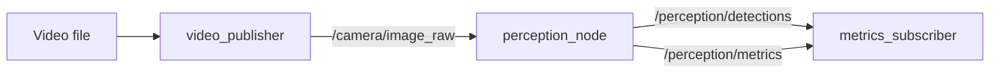

# Week 4: ROS2 + Vision Integration

First portfolio-grade demo: **video → ROS2 image topic → YOLO perception → detection/metrics topics**.

**Run inside Ubuntu 22.04 VM with ROS2 Humble.**

## Architecture



## Topics

| Topic | Type | Description |
|-------|------|-------------|
| `/camera/image_raw` | `sensor_msgs/Image` | Video frames |
| `/perception/detections` | `std_msgs/String` | JSON detection results |
| `/perception/metrics` | `std_msgs/String` | JSON FPS / latency stats |

## Prerequisites

```bash
# ROS2 (VM)
sudo apt install -y ros-humble-cv-bridge ros-humble-vision-msgs

# Python deps (use venv or system pip in VM)
pip install -r week04_ros2_vision/requirements.txt
```

## Build

```bash
cd week04_ros2_vision/ros2_ws
source /opt/ros/humble/setup.bash
colcon build --symlink-install
source install/setup.bash
```

## Run

```bash
ros2 launch ros2_vision_pkg vision_demo.launch.py \
  video_path:=/absolute/path/to/video.mp4 \
  model:=yolov8n.pt
```

## Inspect

```bash
ros2 topic list
ros2 topic echo /perception/metrics
ros2 topic echo /perception/detections
ros2 topic hz /camera/image_raw
```

## Rosbag

```bash
ros2 bag record /camera/image_raw /perception/detections /perception/metrics \
  -o bags/week04_vision
```

## Resume bullet (draft)

> Built a ROS2 perception pipeline integrating camera/video input, YOLO object detection, and real-time FPS/latency telemetry over ROS2 topics.

## Evolution → Main Project

This package is **v0.1** of `projects/perception_sim/`. Next steps: Gazebo camera, depth fusion, simple navigation.
